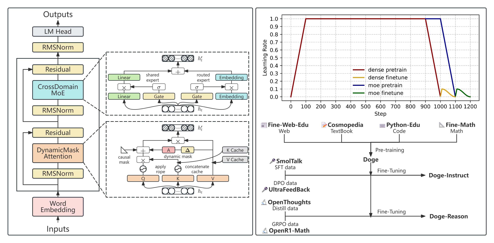
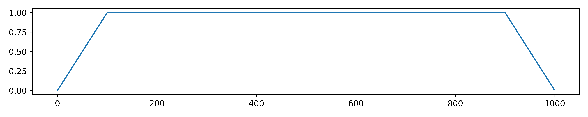

<div align="center">
  
</div>

<hr>

<div align="center">

<!-- [](https://arxiv.org/abs/2412.11834) -->
[](https://discord.gg/P2yYH95N)
[](https://huggingface.co/collections/SmallDoge/doge-slm-679cc991f027c4a3abbded4a)
[](https://opensource.org/licenses/Apache-2.0)


*Small Doges is under construction, let's develop together!🐕🐕🐕*

<h4>

English | [简体中文](./README_zh.md)

</h4>

</div>

**News**:

* **[2025-3-12]** 🎉We have completed the pre-training of four base models with parameters of **Doge-20M**, **Doge-60M**, **Doge-160M**, and **Doge-320M**!
* **[2025-3-9]** 🎉We released the **SmallThoughts** inference dataset, greatly reducing the cost of inference fine-tuning!
* **[2025-2-20]** 🎉 We now support the full training process of **pre-trained Doge-Base**, **instruction fine-tuned Doge-Instruct**, and **reasoning fine-tuned Doge-R1**, please refer to the [guide](./recipes/doge/README.md)!
* **[2025-2-15]** 🚀 We introduce **Doge2**, an enhanced architecture with improved Mixture of Experts design and better scalability!

# small-doge

* This project aims to train a series of dynamic and fast small models from scratch, with the fastest training time of only 3 hours! You can train a tiny language model [Doge-20M](https://huggingface.co/SmallDoge/Doge-20M) in just 13M!🚀
* The small doge series is extremely lightweight, with the smallest version being about **$\frac{1}{7800}$** the size of GPT3, and strives to make even the most ordinary personal GPU capable of fast inference and even training.🏎️
* We provide full-stage code for dataset preprocessing, pre-training, supervised fine-tuning, reinforcement learning preference alignment, visual multimodal VLM (under development), and inference fine-tuning R1 (under development).🧪
* Standing on the shoulders of giants can see further, we hope that the small doge series of small models can provide researchers with more ideas and contribute to the road to achieving **Embodied Artificial General Intelligence**.🤖
* We now offer two model architectures: **Doge** (original) and **Doge2** (enhanced with better MoE design and scalability) to meet different research and application needs.✨

> [!TIP]
> We hope to use open-source tools and frameworks as much as possible to simplify the process from data processing to model training, so that beginners can easily understand and use.🤗


<figcaption>Doge-60M-Instruct on an 11th gen i7 CPU notebook for fast inference</figcaption>


## About

This project aims to develop a series of dynamic and fast small models to promote their application in the field of embodied intelligence, especially in resource-constrained environments, to meet real-time response needs, and to promote the practical application of downstream fields.

<div align="center">
    
</div>

As shown in the figure, the sequence transformation part of the Doge architecture uses `Dynamic Mask Attention`, which can be understood as using self-attention related to value states during training, and using state-space without past state decay during inference, to solve the problem of existing Transformers or SSMs getting lost in long text. The state transformation part of Doge uses `Cross Domain Mixture of Experts`, which consists of dense linear layers and sparse embedding layers, and can additionally increase sparse parameters to continue training from dense weight checkpoints without retraining the entire model, thereby reducing the cost of continuous iteration of the model. In addition, Doge also uses `RMSNorm` and `Residual` with learnable parameters to adapt the gradient range of deep models.

We also provide **Doge2**, an enhanced architecture that builds upon the original Doge design with improved Mixture of Experts capabilities, offering better scalability and performance while maintaining the core efficiency principles.


## Requirements

Our codebase requires the following environment if you need to pre-train or fine-tune:

- Windows or Linux
- NVIDIA GPU
- Python 3.10+
- PyTorch 2.0+
- CUDA 11.8+

We highly recommend that you install the latest version of PyTorch and CUDA for optimal performance.

Of course, you can also use the open-source [Docker PyTorch](https://catalog.ngc.nvidia.com/orgs/nvidia/containers/pytorch) image to avoid the hassle of configuring the environment.

```bash
docker pull nvcr.io/nvidia/pytorch:24.12-py3
docker run --privileged --gpus all -it --name PyTorch --shm-size=32g -p 8888:8888 -p 6006:6006 --ulimit memlock=-1 --ulimit stack=67108864 -v <your code path>:/workspace -v <your datasets path>:/workspace/Doge/datasets nvcr.io/nvidia/pytorch:24.12-py3
```

- `pip install transformers`: The core framework for all subsequent work.
- `pip install datasets sentencepiece boto3`: Used to download and process datasets.
- `pip install accelerate`: Used for distributed training.
- `pip install trl`: Used for fine-tuning with reinforcement learning.


## Installation

```bash
git clone https://github.com/SmallDoges/small-doge.git
cd small-doge
pip install -e .
```


## Quick Start

We have written a [notebook](./examples/notebook.ipynb) and a [training guide for Doge](./recipes/doge/README.md) to demonstrate the entire process of dataset processing, model training, and model evaluation. Doge2 training configurations are available in the [doge2 recipes folder](./recipes/doge2/). You can also use the models that have been released independently. If you are interested, please read the notebook or training guide in detail, which contains specific steps and details!


## Models Released

### Doge-CheckPoint



Doge uses `wsd_scheduler` as the training scheduler, which divides the learning rate into three stages: `warmup`, `stable`, and `decay`. It allows us to continue training on any new dataset from any checkpoint in the `stable stage` without spikes of the training.

Here are the initial learning rates required to continue training at each checkpoint:

- **[Doge-20M](https://huggingface.co/SmallDoge/Doge-20M-checkpoint)**: 8e-3
- **[Doge-60M](https://huggingface.co/SmallDoge/Doge-60M-checkpoint)**: 6e-3
- **[Doge-160M](https://huggingface.co/SmallDoge/Doge-160M-checkpoint)**: 4e-3
- **[Doge-320M](https://huggingface.co/SmallDoge/Doge-320M-checkpoint)**: 2e-3

| Model | Learning Rate | Schedule | Warmup Steps | Stable Steps |
|---|---|---|---|---|
| [Doge-20M](https://huggingface.co/SmallDoge/Doge-20M-checkpoint) | 8e-3 | wsd_scheduler | 800 | 6400 |
| [Doge-60M](https://huggingface.co/SmallDoge/Doge-60M-checkpoint) | 6e-3 | wsd_scheduler | 1600 | 12800 |
| [Doge-160M](https://huggingface.co/SmallDoge/Doge-160M-checkpoint) | 4e-3 | wsd_scheduler | 2400 | 19200 |
| [Doge-320M](https://huggingface.co/SmallDoge/Doge-320M-checkpoint) | 2e-3 | wsd_scheduler | 3200 | 25600 |

### Doge-Base

**Pre-Training**:
| Model | Training Data | Steps | Content Length | Tokens | LR | Batch Size | Precision | RTX 4090 GPU hours |
|---|---|---|---|---|---|---|---|---|
| [Doge-20M](https://huggingface.co/SmallDoge/Doge-20M) | [smollm-corpus](https://huggingface.co/datasets/HuggingFaceTB/smollm-corpus) | 8k  | 2048 | 4B | 8e-3 | 0.5M | bfloat16 | 14 |
| [Doge-60M](https://huggingface.co/SmallDoge/Doge-60M) | [smollm-corpus](https://huggingface.co/datasets/HuggingFaceTB/smollm-corpus) | 16k  | 2048 | 16B | 6e-3 | 1M | bfloat16 | 128 |
| [Doge-160M](https://huggingface.co/SmallDoge/Doge-160M) | [smollm-corpus](https://huggingface.co/datasets/HuggingFaceTB/smollm-corpus) | 24k  | 2048 | 32B | 4e-3 | 1.5M | bfloat16 | 522 |
| [Doge-320M](https://huggingface.co/SmallDoge/Doge-320M) | [smollm-corpus](https://huggingface.co/datasets/HuggingFaceTB/smollm-corpus) | 32k  | 2048 | 64B | 2e-3 | 2M | bfloat16 | 1856 |

**Evaluation**:
| Model | MMLU | TriviaQA | ARC | PIQA | HellaSwag | OBQA | Winogrande | tokens / s on i7-11 CPU |
|---|---|---|---|---|---|---|---|---|
| [Doge-20M](https://huggingface.co/SmallDoge/Doge-20M) | 25.4 | 0.03 | 29.8 | 58.4 | 27.3 | 25.6 | 50.2 | 142 |
| [Doge-60M](https://huggingface.co/SmallDoge/Doge-60M) | 26.4 | 0.2 | 37.9 | 61.4 | 31.5 | 28.0 | 50.8 | 62 |
| [Doge-160M](https://huggingface.co/SmallDoge/Doge-160M) | 29.2 | 4.8 | 44.4 | 70.1 | 43.4 | 34.4 | 52.2 | 28 |
| [Doge-320M](https://huggingface.co/SmallDoge/Doge-320M) | 33.8 | 9.4 | 52.1 | 73.9 | 52.7 | 37.9 | 55.0 | 16 |

### Doge-Instruct

**SFT**:
| Model | Training Data | Epochs | Content Length | LR | Batch Size | Precision |
|---|---|---|---|---|---|---|
| [Doge-20M-Instruct-SFT](https://huggingface.co/SmallDoge/Doge-20M-Instruct-SFT) | [smoltalk](https://huggingface.co/datasets/HuggingFaceTB/smoltalk) | 2 | 2048 | 8e-4 | 0.25M | bfloat16 |
| [Doge-60M-Instruct-SFT](https://huggingface.co/SmallDoge/Doge-60M-Instruct-SFT) | [smoltalk](https://huggingface.co/datasets/HuggingFaceTB/smoltalk) | 2 | 2048 | 6e-4 | 0.25M | bfloat16 |
| [Doge-160M-Instruct-SFT](https://huggingface.co/SmallDoge/Doge-160M-Instruct-SFT) | [smoltalk](https://huggingface.co/datasets/HuggingFaceTB/smoltalk) | 2 | 2048 | 4e-4 | 0.25M | bfloat16 |

**DPO**:
| Model | Training Data | Epochs | Content Length | LR | Batch Size | Precision |
|---|---|---|---|---|---|---|
| [Doge-20M-Instruct](https://huggingface.co/SmallDoge/Doge-20M-Instruct) | [ultrafeedback](https://huggingface.co/datasets/HuggingFaceH4/ultrafeedback_binarized) | 2 | 1024 | 8e-5 | 0.125M | bfloat16 |
| [Doge-60M-Instruct](https://huggingface.co/SmallDoge/Doge-60M-Instruct) | [ultrafeedback](https://huggingface.co/datasets/HuggingFaceH4/ultrafeedback_binarized) | 2 | 1024 | 6e-5 | 0.125M | bfloat16 |
| [Doge-160M-Instruct](https://huggingface.co/SmallDoge/Doge-160M-Instruct) | [ultrafeedback](https://huggingface.co/datasets/HuggingFaceH4/ultrafeedback_binarized) | 2 | 1024 | 4e-5 | 0.125M | bfloat16 |

**Evaluation**:
| Model | IFEval (Prompt Strict Acc) | MMLU | BBH | ARC | PIQA | HellaSwag | tokens / s on i7-11 CPU |
|---|---|---|---|---|---|---|---|
| [Doge-20M-Instruct](https://huggingface.co/SmallDoge/Doge-20M-Instruct) | 7.3 | 26.3 | 18.3 | 29.2 | 57.8 | 27.8 | 142 |
| [Doge-60M-Instruct](https://huggingface.co/SmallDoge/Doge-60M-Instruct) | 7.4 | 27.5 | 27.7 | 37.5 | 61.4 | 32.1 | 62 |
| [Doge-160M-Instruct](https://huggingface.co/SmallDoge/Doge-160M-Instruct) | 16.8 | 29.7 | 29.1 | 42.8 | 64.1 | 37.1 | 28 |


**Training Environment**:

- Image: nvcr.io/nvidia/pytorch:24.12-py3
- Hardware: 1x NVIDIA RTX 4090
- Software: Transformers, TRL


### Doge2 (Enhanced Architecture)

**Doge2** represents our next-generation model architecture with enhanced Mixture of Experts design:

- **Improved MoE**: Enhanced expert routing with up to 900 experts and 15 experts per token
- **Better Scalability**: Optimized architecture for larger parameter counts while maintaining efficiency  
- **Enhanced Performance**: Improved training stability and convergence
- **Extended Vocabulary**: Support for larger vocabulary sizes (up to 49,152 tokens)

*Doge2 models are currently in active development. Training recipes and model weights will be released soon.*


## Expectations
> [!IMPORTANT]
> - If you find this project helpful, please consider giving it a star ⭐! <br><br>
> - Due to time and expertise constraints, there may be omissions in the project.
> Feel free to submit your insights through Issues or PRs to help improve the project, your support is the driving force behind the continuous progress of the project!😊 <br><br>
> - One person can go fast, but a group of people can go further. If you have already trained a new small-doge model, feel free to share your model weights, training recipes, evaluation results, and other relevant information in Discussions or Issues. It can be a new small-doge model version for specific downstream tasks or vertical fields, such as sentiment recognition, medical, psychological, financial, legal Q&A, etc. It can also be an expanded training, such as exploring new small-doge model versions with longer text sequences, larger parameters, or larger datasets. Your sharing will greatly promote the development of the community!🚀🚀🚀


## Star History

[](https://star-history.com/#SmallDoges/small-doge&Date)


## Citation

If you use this codebase, or otherwise find our work valuable, please cite our repository, the paper is coming soon:

```bibtex
@misc{smalldoges,
    title={SmallDoges: A Family of Dynamic UltraFast Small Language Models}, 
    author={Jingze, Shi and Yifan, Wu and Bingheng, Wu and Yuyu, Luo},
    year={2025},
    month={March},
    url={https://github.com/SmallDoges/small-doge}
}
```
