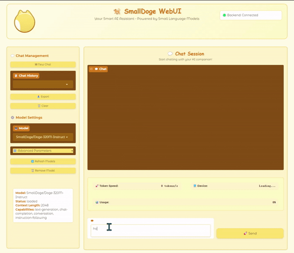

<div align="center">
  
</div>

<div align="center">

[](https://discord.gg/P2yYH95N)
[](https://huggingface.co/collections/SmallDoge/doge-slm-679cc991f027c4a3abbded4a)
[](https://opensource.org/licenses/Apache-2.0)

**English** | [简体中文](./README_zh.md)

</div>

# SmallDoge: Ultra-Fast Small Language Models

> **Train a 20M parameter language model in just 3 hours!** 🚀

SmallDoge is a family of dynamic, ultra-fast small language models designed for **efficiency** and **accessibility**.

## ✨ Key Features

- **🚀 Ultra-Fast Training**: 3-hour training for 20M models
- **💡 Innovative Architecture**: Dynamic Mask Attention + Cross Domain MoE
- **🏎️ Lightning Inference**: 142 tokens/s on i7-11 CPU
- **🔧 Complete Toolkit**: Pre-training → Instruction Fine-tuning → Reasoning Fine-tuning
- **🌐 Web Interface**: Built-in chat interface and OpenAI-compatible API

<div align="center">
    
    <br><em>Doge-60M-Instruct running on i7-11 CPU</em>
</div>


## 🚀 Quick Start

### Installation

```bash
git clone https://github.com/SmallDoges/small-doge.git
cd small-doge
pip install -e .
```

### Basic Usage

```python
from transformers import AutoTokenizer, AutoModelForCausalLM

# Load model
model_name = "SmallDoge/Doge-60M-Instruct"
tokenizer = AutoTokenizer.from_pretrained(model_name, trust_remote_code=True)
model = AutoModelForCausalLM.from_pretrained(model_name, trust_remote_code=True)

# Generate text
prompt = "Explain machine learning in simple terms:"
inputs = tokenizer(prompt, return_tensors="pt")
outputs = model.generate(**inputs, max_length=200, temperature=0.7)
print(tokenizer.decode(outputs[0], skip_special_tokens=True))
```

### Web Interface

```bash
# Install WebUI
pip install -e '.[webui]'

# Launch interface
small-doge-webui
```

**Access**: http://localhost:7860 (Frontend) | http://localhost:8000 (API)

📖 **Detailed guides**: [Quick Start](./docs/quickstart.md) | [Installation](./docs/installation.md) | [Training](./docs/training.md)

## 📊 Available Models

| Model | Size | Speed (i7-11 CPU) | MMLU | Use Case |
|-------|------|------------------|------|----------|
| [Doge-20M](https://huggingface.co/SmallDoge/Doge-20M) | 20M | 142 tok/s | 25.4 | Ultra-fast prototyping |
| [Doge-60M](https://huggingface.co/SmallDoge/Doge-60M) | 60M | 62 tok/s | 26.4 | Balanced performance |
| [Doge-160M](https://huggingface.co/SmallDoge/Doge-160M) | 160M | 28 tok/s | 29.2 | Better reasoning |
| [Doge-320M](https://huggingface.co/SmallDoge/Doge-320M) | 320M | 16 tok/s | 33.8 | Production ready |

**Instruction Models**: Add `-Instruct` to any model name for chat-optimized versions.

**Checkpoints**: Add `-checkpoint` for continued training (see [Model Docs](./docs/models.md)).

## 🏗️ Architecture

<div align="center">
    
</div>

**Key Innovations:**
- **Dynamic Mask Attention**: Dynamic attention mechanism for efficient long sequences
- **Cross Domain Mixture of Experts**: Sparse experts with dense-to-sparse continuation training
- **WSD Scheduler**: Warmup-Stable-Decay for seamless checkpoint resumption


## 🎓 Training Pipeline

SmallDoge supports complete three-stage training:

1. **Pre-training** → Base models (Doge-Base)
2. **Instruction Fine-tuning** → Chat models (Doge-Instruct) 
3. **Reasoning Fine-tuning** → Reasoning models (Doge-Reason)

**Key Features:**
- 🚀 **One-stop processor**: Unified data handling across all stages
- 🔧 **Flexible recipes**: Pre-configured training configs
- 📊 **Efficient training**: Optimized for small models
- 🔄 **Seamless continuation**: WSD scheduler for checkpoint resumption

**Training Times** (RTX 4090):
- Doge-20M: 14 hours | Doge-60M: 128 hours | Doge-160M: 522 hours | Doge-320M: 1856 hours

📚 **Learn more**: [Training Guide](./docs/training.md)

## 📈 Evaluation Results

### Base Models
| Model | MMLU | ARC | PIQA | HellaSwag | Winogrande |
|-------|------|-----|------|-----------|------------|
| Doge-20M | 25.4 | 29.8 | 58.4 | 27.3 | 50.2 |
| Doge-60M | 26.4 | 37.9 | 61.4 | 31.5 | 50.8 |
| Doge-160M | 29.2 | 44.4 | 70.1 | 43.4 | 52.2 |
| Doge-320M | 33.8 | 52.1 | 73.9 | 52.7 | 55.0 |

### Instruction Models
| Model | IFEval | MMLU | BBH | Performance |
|-------|--------|------|-----|-------------|
| Doge-20M-Instruct | 7.3 | 26.3 | 18.3 | Good for basic chat |
| Doge-60M-Instruct | 7.4 | 27.5 | 27.7 | Balanced chat model |
| Doge-160M-Instruct | 16.8 | 29.7 | 29.1 | Advanced reasoning |

🔍 **Evaluation toolkit**: [Evaluation Guide](./docs/evaluation.md)

## 🛠️ Use Cases

- **🤖 Edge AI**: Deploy on resource-constrained devices
- **🎮 Gaming**: Real-time NPC dialogue and game mechanics
- **📱 Mobile Apps**: On-device AI assistants
- **🔬 Research**: Fast prototyping and experimentation
- **📚 Education**: Learning AI/ML with manageable models
- **🏭 Industry**: Lightweight production deployments

## 📦 Project Structure

```
small-doge/
├── src/small_doge/          # Core implementation
│   ├── models/              # Model architectures  
│   ├── trainer/             # Training code
│   ├── processor/           # Data processing
│   └── webui/               # Web interface
├── recipes/                 # Training recipes
│   └── doge/                # Doge model configs
├── examples/                # Tutorials & examples
├── evaluation/              # Evaluation toolkit
├── docs/                    # Documentation
└── assets/                  # Images & resources
```


## 🤝 Contributing

We welcome contributions! Here's how you can help:

- 🐛 **Report bugs**: [GitHub Issues](https://github.com/SmallDoges/small-doge/issues)
- 💡 **Suggest features**: [Discussions](https://github.com/SmallDoges/small-doge/discussions)
- 📚 **Improve docs**: Submit PRs for documentation
- 🏋️ **Share models**: Contribute trained models and recipes
- 💬 **Join community**: [Discord](https://discord.gg/P2yYH95N)

## 📚 Documentation

- **[📖 Quick Start](./docs/quickstart.md)** - Get started in 5 minutes
- **[⚙️ Installation](./docs/installation.md)** - Detailed setup guide  
- **[🎓 Training](./docs/training.md)** - Complete training pipeline
- **[🤖 Models](./docs/models.md)** - Architecture and performance
- **[🌐 WebUI](./docs/webui.md)** - Web interface guide
- **[🔧 Examples](./examples/)** - Jupyter notebooks and tutorials
- **[📊 Evaluation](./evaluation/)** - Benchmarking toolkit

## 📄 Citation

```bibtex
@misc{smalldoges2025,
    title={SmallDoges: A Family of Dynamic Ultra-Fast Small Language Models}, 
    author={Jingze Shi and Yifan Wu and Bingheng Wu and Yuyu Luo},
    year={2025},
    month={March},
    url={https://github.com/SmallDoges/small-doge}
}
```

## 📄 License

This project is licensed under the Apache-2.0 License - see the [LICENSE](LICENSE) file for details.

---

<div align="center">

**Built with ❤️ by the SmallDoge Team**

[](https://star-history.com/#SmallDoges/small-doge&Date)

*Give us a ⭐ if you find SmallDoge helpful!*

</div>
