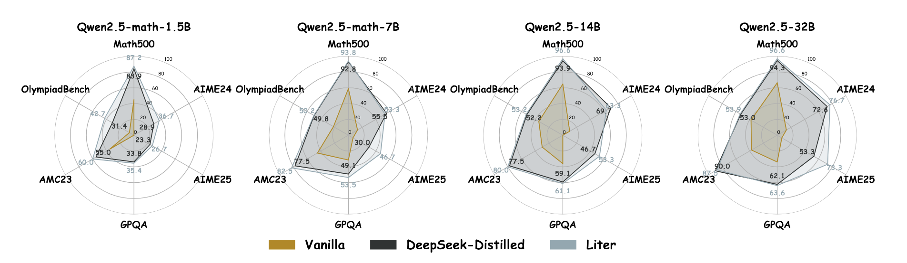

# LiteCoT: Concise Reasoning, Big Gains: Pruning Long Reasoning Trace with Difficulty-Aware Prompting

[](https://github.com/huggingface/open-r1/blob/main/LICENSE)

**LiteCoT** This project is the official open-source implementation of the [LiteCoT]() paper. Currently, we have fully open-sourced both the training data and training scripts.

## News

🔥 [2025/05/20] (update #1): We release the traing datasets and all the corresponding Liter Models.

## Outline

* [Overview](#Overview)
* [To do list](#TODO)
* [Datasets](#Datasets)
* [Installation](#Installation)
* [Training](#Training)


## Overview


We use DAP pipeline to generate LiteCoT datasets and trained Liter based on this LiteCoT.
Overview of the DAP pipeline. First, the DeepSeek R1 model generates initial Long CoT
data from collected user queries. Then, a difficulty-aware prompt guides the model to rewrite concise
CoT outputs, adapting reasoning length dynamically based on problem difficulty


## To do list

- [ ] Open source all the evaluation scripts
- [x] Open source Liter series model weights
- [x] Open source training scripts
- [x] Open source training data

## Installation

```bash
1. git clone https://github.com/Evanwu1125/LiteCoT.git
2. cd LiteCoT
3. conda create --name <env_name> --file requirements.txt
```

## Datasets

### Step 1: Dataset Link
You can find the corresponding dataset [here](https://huggingface.co/datasets/SmallDoge/SmallThoughts)

### Step 2: Download the corresponding datasets

If you have problems directly having access to huggingface, you can use the following command.
```bash
pip install -U huggingface_hub # download huggingface_hub package

export HF_ENDPOINT=https://hf-mirror.com # using  huggingface mirror

huggingface-cli download --repo-type dataset --resume-download  SmallDoge/SmallThoughts --local-dir /path/to/your/dir # terminal download command

```
### Step 3: Preprocess the datasets

Using the ```training_data/convert_parquet.py``` to preprocess the downloaded datasets.

## Training
Here we provide different recipes for training different sizes of models from 1.5B to 32B, all the models are STF based on the Qwen2.5 models.

### Step 1: Download the weights of the base model.

  
If you have problems directly having access to huggingface, you can use the following command.
```bash
export HF_ENDPOINT=https://hf-mirror.com # using  huggingface mirror

huggingface-cli download --resume-download  Qwen/Qwen2.5-Math-1.5B --local-dir model_results/qwen2.5-math-1.5b # terminal download command

```

### Step 2: Choosing the corresponding training recipes.
```bash
#We use qwen2.5-math-7b here as an example.
run scripts/run_7b-math-training-short.sh
```

### Step 3: Check the checkpoints

You can see all the checkpoints preserved in ```model_results```.


In case you want you directly use our trained models, we provide all the weights here.

| Our Model Name | Original Model Weights |
|----------------|------------------------|
| [LiteCoT-1.5B](Evanwu50020/qwen2.5-1.5b-math-shortcot-100k) | Qwen2.5-Math-1.5B-Base |
| [LiteCoT-7B](Evanwu50020/qwen2.5-7b-math-shortcot-100k) | Qwen2.5-Math-7B-Base |
| [LiteCoT-14B](SmallDoge/Qwen2.5-14B-shortcot-100k) | Qwen2.5-14B-Base |
| [LiteCoT-32B](SmallDoge/Qwen2.5-32B-shortcot-100k) | Qwen2.5-32B-Base | 
            
The results are shown below:


            
            
            
            
            
            
            
            
            
            
            
          